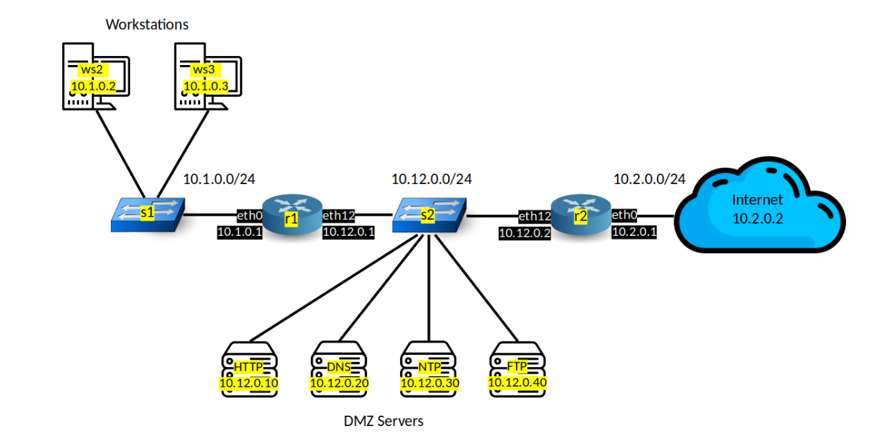

## LINFO2347 - Network Attacks - Project 2

### Basic enterprise network protection

- Workstations can send a ping and initiate a connection towards any other host (other workstations, DMZ servers, internet).
    - No specific firewall rule is set for workstations
- DMZ servers cannot send any ping or initiate any connection. They can only respond to incoming connections.
    - For each DMZ server a firewall is implemented.
        - input chain
            - default drop
            - icmp echo request accept => allows others to ping
            - tcp dport <ports whished to be open> accept
        - output chain
            - default drop
            - icmp echo request drop => dmz server cannot initiate a echo request
            - connection track only allow establised and related connections => stateful
- The Internet can send a ping or initiate a connection only towards DMZ servers. They cannot send a ping or initiate connections towards workstations.
    - No firewall is implemented in r2 router.
    - At the r1 router
        - forward chain
            - forward only icmp echo requests from the subnet 10.1.0.0/24
            - connection track drop any new connection request from the subnet 10.2.0.0/24 (internet)
            - finnaly accept new, established, related connections with connection track.

### Attacks
#### Network Scan

#### SSH and FTP brute force

### Protections

---
#### Questions
- complexity of attacks
- firewall rules, blocking ip ranges ? 
- where the attacks will be launched, up to us ? 
- protections for the attacks, blocking, timeout, ...
