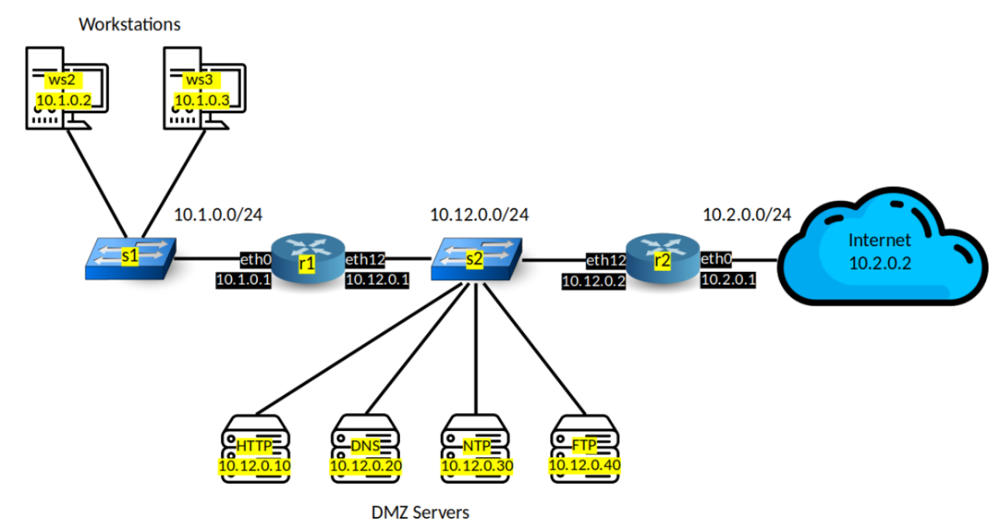
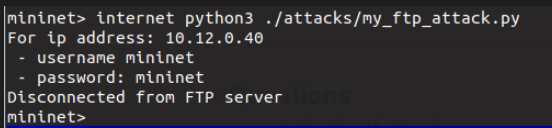

## LINFO2347 - Network Attacks - Project 2

### Basic enterprise network protection

#### Requirements
##### Workstations can send a ping and initiate a connection towards any other host (other workstations, DMZ servers, internet).
- No specific firewall rule is set at workstations
##### DMZ servers cannot send any ping or initiate any connection. They can only respond to incoming connections.
- For each DMZ server a firewall is implemented.
        - input chain
            - default drop
            - icmp echo request accept => allows others to ping
            - tcp dport {<"ports wished to be opened">}accept
        - output chain
            - default drop
            - icmp echo request drop => dmz server cannot initiate a echo request
            - connection track only allow establised and related connections => stateful

- **Example for the http server:**
```nft
#!/usr/sbin/nft -f

flush ruleset

# INPUT AND OUTPUT FILTERS AT HTTP SERVER

table ip http_filter {
    # Input chain
    chain input {
        type filter hook input priority 0; policy drop;

        # Accept connections to ports 22 and 80
        tcp dport {22, 80} accept
        
        # Accept incoming echo-requests 
        icmp type echo-request counter accept
    }
    # Output chain
    chain outputting {                                                           
        type filter hook output priority 0; policy drop;                            
        # Drop any outgoing icmp echo-requests
        # => DMZ servers cannot intiate echo requests 
        icmp type echo-request counter drop                                                                             
        # Only allow established and related connections
        # - Given that we only allow connections to ports 22 and 80
        # - This prevents DMZ servers initiating new connections 
        # - but keeps them functional.
        ct state { established, related } accept
    }
}        
```

##### The Internet can send a ping or initiate a connection only towards DMZ servers. They cannot send a ping or initiate connections towards workstations.
- No firewall is implemented at router 2.
- At router 1 the following filtering is implemented.
```nft
#!/usr/sbin/nft -f

flush ruleset

# FORWARDING FILTER AT ROUTER 1

table ip filter_for_r1 {
    # Forwarding chain at the router 1
    chain forwarding {                                                 
        type filter hook forward priority 0; policy drop;              
        
        # Accept icmp echo requests from subnet 10.1.0.0/24
        # - Workstations can initiate ping requests
        icmp type echo-request ip saddr 10.1.0.0/24 accept     

		# Drop other icmp requests
        icmp type echo-request counter drop
        
        # Drop new connections from the internet (subnet 10.2.0.0/24 )
        ct state new ip saddr 10.2.0.0/24 drop
        
        # Accept other connections
        ct state {new, established, related } accept                   
    }                                                                      
}
```


### Attacks
#### Setup
- Go to `LINFO2347` directory.
- Clone the repository for the attacks.
```
git clone https://github.com/BayKeremm/linfo2347-network-attacks.git
```

- We have modified the `topo.py` file so update it with the following commands.
```bash
rm topo.py
cp ./linfo2347-network-attacks/topo.py ./
```

- Run
```bash
sudo -E python3 ~/LINFO2347/topo.py
```

#### Network Scan
This attack is run from the internet towards the enterprise. The following options are considered:
- ARP scan
	- Layer 2 broadcast, does not pass through routers and we are not inside the enterprise network.
- TCP scan
	- We have the following IP ranges:
		- 10.12.0.0/24 (DMZ servers)
	    - 10.1.0.0/24 (Work stations)
	- Try to connect to each ip address in those ranges with a given port range.

TCP scan is selected to scan the network from the internet (10.2.0.2).
Ranges are hard coded in the script so running the following inside mininet will start the attack:
```bash
internet python3 ./linfo2347-network-attacks/attacks/my_scanner.py
```
And the script will output which machines have which ports open to the terminal.
**Note**: It only scans ports from 0 to 100, we could increase this but then we need to wait longer.

Network scan outputs results into the file `scan_results.txt` which is then used by the SSH and FTP brute force attacks.
#### SSH and FTP brute force
##### SSH brute force
Using the results from the network scan, it reads the `scan_results.txt` file to a dictionary with the corresponding open ports then filters the ip addresses that have port 22 open,  and using the mirai wordlists taken from https://github.com/kkrypt0nn/wordlists for passwords and users SSH brute force is done.
```bash
internet python3 ./linfo2347-network-attacks/attacks/my_ssh_attack.py
```
**Note:** After some time the script gives errors `Error reading SSH protocol banner` or `Error Connection reset by peer`, we could not find what caused these errors but the script continues to run after that.

If it finds the credentials it outputs as follows (to show that it works we put the correct ones in the wordlists):


##### FTP brute force
Similarly to SSH brute force, it reads the results from the network scan, then filters them with ip addresses that have the ports `21` open. Then using the wordlist for FTP taken from https://github.com/danielmiessler/SecLists, the brute force is done.
```bash
internet python3 ./linfo2347-network-attacks/attacks/my_ftp_attack.py
```

If we put the correct credentials again, the script exits like the following:


### Protections
#### Setup
We would need to update the nft scripts running on the hosts. Router 1 has no changes in its firewall (Run the commands one by one).
``` bash
dns nft -f linfo2347-network-attacks/filters/protected_op/dns.nft 
http nft -f linfo2347-network-attacks/filters/protected_op/http.nft 
ftp nft -f linfo2347-network-attacks/filters/protected_op/ftp.nft 
ntp nft -f linfo2347-network-attacks/filters/protected_op/ntp.nft
```
#### SSH brute and FTP brute force
The protections for these two attacks follow the same principle. We block the ip that makes requests with a rate over 3/minute. This ip is then blocked for 5 minutes.

**Example for the http server**:
What is added are under `### PROTECTION` comments.
```nft
#!/usr/sbin/nft -f                                                                  
flush ruleset                                                                                                                            
table ip http_filter {                                                              
	### PROTECTION
	# A set for ip addresses to be denied.
    set denylist {                                                                  
        type ipv4_addr; flags dynamic, timeout; timeout 5m;                         
    }                                                                               
    chain input {                                    
        type filter hook input priority 0; policy drop;                                                                                             
		### PROTECTION        
        # Drop ip source addresses in the deny list
        ip saddr @denylist drop                                                     
	    ### PROTECTION
        # Keep track of new connections at port 22 with "ct" 
        # If the rate if over 3/min
        # Put the source ip in deny list 
        tcp dport 22 ct state new, untracked limit rate over 3/minute add @denylist { ip saddr } 
        
        tcp dport {22, 80} accept                                                   
        icmp type echo-request counter accept 
    }                                                                                                                                                
    chain outputting {                                                           
        type filter hook output priority 0; policy drop;
        icmp type echo-request counter drop
        ct state { established, related } accept
    }
}                                                                               
```

Now running the ssh attack, or running simply `internet ssh http` for 6 times in our case, the server does not respond. Then, we can confirm that it is indeed blocking the internet's ip address with the following command.

``` bash
http nft list ruleset | less
```

We see the following output. The denylist has elements and we can see the internet's ip address there with a countdown of 5 mins.


